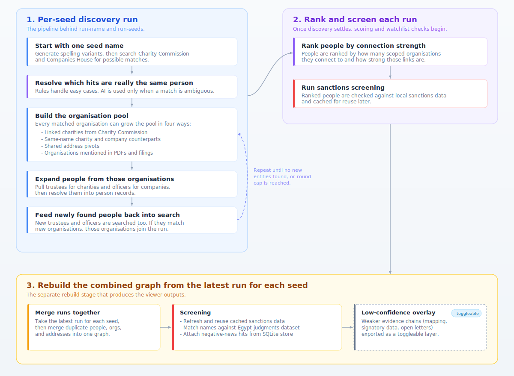
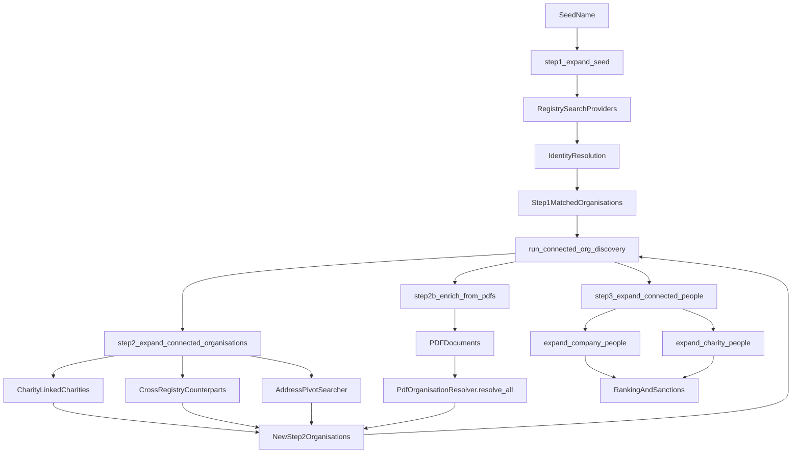

# Project Istari

CLI pipeline for linking people to England & Wales charities and companies.

Given one or more **seed names**, Istari searches UK public registries, resolves entity matches with AI, expands the network of connected organisations and people, and screens results against sanctions lists — producing a ranked, explorable network graph.

## Architecture



### Discovery flow

The current discovery flow below matches the live pipeline in `src/services/mvp_pipeline.py`, the PDF organisation resolver in `src/services/pdf_enrichment.py`, and the address pivot searcher in `src/address_pivot.py`.



Discovery notes:
- `step1_expand_seed()` generates variants, searches the configured registry providers, then resolves candidate matches into initial step-1 organisations.
- `run_connected_org_discovery()` now runs connected-org discovery in rounds so newly found charities, companies, address pivots, and PDF-discovered institutions can feed later rounds before people expansion starts.
- `step2_expand_connected_organisations()` currently expands three connected-org paths: linked charities, same-name cross-registry counterparts, and shared-address pivots.
- `step2b_enrich_from_pdfs()` extracts organisation mentions from filings and annual reports; `PdfOrganisationResolver.resolve_all()` now checks both Companies House and Charity Commission for each institution mention.
- `step3_expand_connected_people()` runs only after discovery rounds have stabilised, then expands trustees/officers from all scoped organisations.

### Pipeline steps

1. **Seed Expansion** — Generate name variants and search UK charity/company registries for candidate organisations.
2. **Identity Resolution** — Score candidates with rules; use an LLM to decide ambiguous same-person matches and persist the initial matched organisations.
3. **Connected Org Discovery** — Repeatedly expand linked charities, same-name company/charity counterparts, shared-address pivots, and PDF-discovered organisation mentions until no new organisations are added.
4. **People Expansion** — Pull officers and trustees for every scoped organisation after discovery has stabilised.
5. **Ranking + Sanctions** — Rank people by connection strength and screen them against sanctions lists.
6. **Graph Consolidation** — Merge duplicate people and addresses across runs into one unified graph.
7. **Output** — Serve an interactive network graph and export JSON for the web viewer.

### Low-confidence overlay

The combined graph includes a dedicated low-confidence overlay for mapping-derived evidence such as open letters and signatory lists, folded in from cleaned mapping databases.

- Matched people resolve onto the existing graph identity node when there is a unique seed/identity match.
- Matched organisations resolve onto existing graph organisations in three passes: exact label or alias match, deterministic company-suffix variants such as `Ltd`/`Limited`, then an AI tie-break only for unresolved organisation labels with a short candidate list.
- Accepted low-confidence organisation resolutions are persisted into `mapping_matches` inside `data/mapping_links.combined.sqlite` during graph rebuilds.
- Open letters are emitted as low-confidence document nodes; represented organisations listed in those letters are emitted as linked organisation nodes, with viewer text that states when a signer signed representing that organisation.
- In the viewer these appear as reviewer-visible **identity → open letter → organisation** chains, rendered as yellow dashed inclusions, while the separate grey indirect-connection view stays limited to main-graph paths.
- The overlay is exported separately from the consolidated graph so it can be toggled on and off in the Netlify viewer.

### Data sources

| Source | Usage |
|---|---|
| **Charity Commission for England & Wales** | Charity search, trustee details, linked entities |
| **Companies House** | Officer search, company profiles, appointments, date of birth |
| **Gemini / OpenAI** | Entity resolution, address resolution, PDF extraction |
| **Serper** | Web search for supplementary evidence |
| **Court / sanctions / bank-freeze documents** | Adverse-media review artifacts and extracted legal rosters in `docs/egypt-saudi-court-bank-freeze-extracts.md` |
| **Sanctions lists** | OFAC SDN, UK Sanctions List, France DG Tresor, Germany Finanzsanktionsliste |

### Storage & output

| Component | Description |
|---|---|
| **SQLite** | Entities, relationships, resolution decisions, and run metadata |
| **Flask web UI** | Interactive network graph at `localhost:5000` |
| **JSON export** | Graph payload for the Netlify viewer |
| **Graph rebuild** | Cross-run merge of people and addresses into a single combined graph |
| **Low-confidence overlay** | Separate JSON layer for dashed yellow evidence chains from cleaned mapping/signatory databases |

## Quick start

```bash
# Install
pip install -e .

# Set API keys in .env
cp .env.example .env

# Initialise the database
python -m src.cli init-db

# Run the full pipeline for a seed name
python -m src.cli run-name "Jane Smith"

# Or run multiple seeds with overlap analysis
python -m src.cli run-seeds "Jane Smith" "John Doe"

# Pilot adverse-media search for one or more people
python -m src.cli negative-news --pages 2 --num 10 "Jane Smith"

# Launch the web UI
python -m src.cli web-ui

# Rebuild the combined graph from all saved runs
python scripts/rebuild_graph.py
```

Graph rebuild convention: new rebuild stages should normally be implemented as small dedicated modules/helpers and then plugged into `scripts/rebuild_graph.py`, rather than expanding the merge engine directly.

## CLI reference

| Command | Description |
|---|---|
| `init-db` | Create the SQLite schema |
| `run-name NAME` | Full pipeline for one seed |
| `run-seeds NAME [NAME ...]` | Full pipeline per seed + overlap |
| `step1-seed NAME` | Seed expansion only |
| `step2-orgs RUN_ID` | Org expansion only |
| `pdf-enrich RUN_ID` | PDF enrichment only |
| `step3-people RUN_ID` | People expansion only |
| `step4-ofac RUN_ID` | Sanctions screening only |
| `rank` | Rank people by connections |
| `negative-news NAME [NAME ...]` | Serper + extraction + Gemini adverse-media pilot |
| `negative-news-clusters` | Batch adverse-media screening for top merged person clusters |
| `negative-news-extract-test URL` | Fetch one article and inspect extraction QA |
| `export-network --run-id ID` | Export graph as JSON |
| `web-ui` | Launch the Flask web UI |
| `healthcheck` | Check API keys and tooling |

## Negative-news pilot

`negative-news` is a standalone adverse-media pass that:

1. Searches Serper for quoted English and generated Arabic name variants.
2. Fetches the linked page and extracts whole-page text for review.
3. Uses Gemini to classify strict Muslim Brotherhood and broader Islamist connectedness signals.

Useful flags:

- `--context-term "ORG NAME"` adds quoted org phrases to the quoted name queries.
- When a quoted org term is used, results are only kept if that exact org phrase appears in the search title, snippet, or extracted page text.
- `--max-articles` caps fetch/classification volume per person.
- `--no-classify` runs discovery and extraction only.
- `--out PATH` writes the JSON report to disk.

Use `negative-news-extract-test` when you want to QA a single URL's extraction output before spending Gemini calls on larger runs.

`negative-news-clusters` runs the same screening flow over the top merged people from the combined graph:

- It uses the latest saved run for each seed, merges expanded people into cross-run clusters, and ranks those merged clusters by cumulative link score.
- It searches every English alias in the cluster for 10 pages, generates one most-plausible Arabic alias from the lead cluster name and searches that for 10 pages, then runs a shorter 2-page quoted-name plus quoted-organisation pass across all linked organisations in the cluster.
- Org-qualified hits are only retained when the quoted organisation phrase appears in the title, snippet, or extracted page text.
- `--max-articles` caps how many unique URLs are fetched and classified per merged cluster after URL dedupe.

Review artifacts produced from this work:

- `docs/mb-screening-sources.md` is the current screening-grade shortlist of legal / official sources.
- `docs/egypt-saudi-court-bank-freeze-extracts.md` stores the long-form extracted rosters and excerpts behind that shortlist.
- `docs/negative-news-lists-review.md` is the archived broader review log from the exploration pass.
