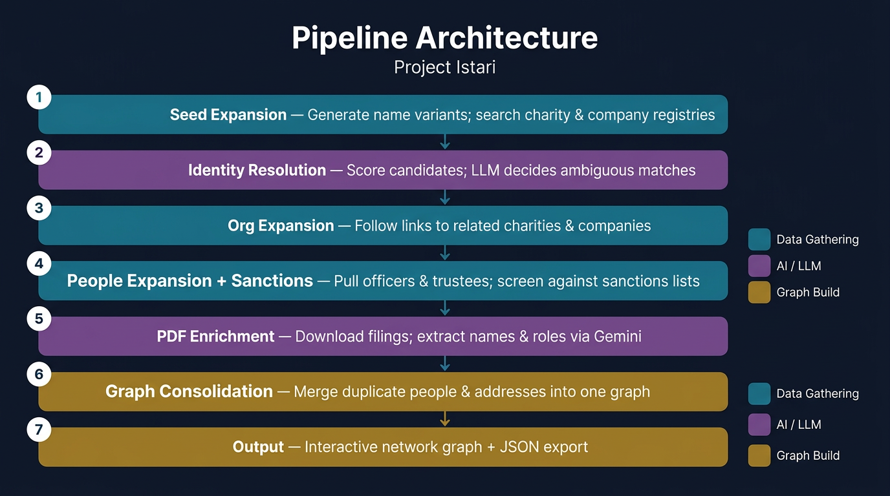

# Project Istari

CLI pipeline for linking people to England & Wales charities and companies.

Given one or more **seed names**, Istari searches UK public registries, resolves entity matches with AI, expands the network of connected organisations and people, and screens results against sanctions lists — producing a ranked, explorable network graph.

## Architecture



### How it works

1. **Seed Expansion** — Generate name variants and search UK charity/company registries for matches.

2. **Identity Resolution** — Score candidates with rules; use an LLM to decide ambiguous same-person matches.

3. **Org Expansion** — Follow confirmed matches to linked charities and companies; find more orgs at shared addresses.

4. **People Expansion + Sanctions** — Pull officers and trustees for each organisation; rank by connection strength; screen against sanctions lists.

5. **PDF Enrichment** — Download annual reports and filings; extract names and roles using Gemini.

6. **Graph Consolidation** — Merge duplicate people and addresses across runs into one unified graph.

7. **Output** — Serve an interactive network graph and export JSON for the web viewer.

### Data sources

- **Charity Commission for England & Wales** — charity search, trustee details, linked entities
- **Companies House** — officer search, company profiles, appointments, date of birth
- **Gemini / OpenAI** — entity resolution, address resolution, PDF extraction
- **Serper** — web search for supplementary evidence
- **Sanctions lists** — OFAC SDN, UK Sanctions List, France DG Tresor, and Germany Finanzsanktionsliste

### Storage & output

- **SQLite** — entities, relationships, resolution decisions, and run metadata
- **Flask web UI** — interactive network graph at `localhost:5000`
- **JSON export** — graph payload for the Netlify viewer
- **Graph rebuild** — cross-run merge of people and addresses into a single combined graph

## Quick start

```bash
# Install
pip install -e .

# Set API keys in .env
cp .env.example .env

# Initialise the database
python -m src.cli init-db

# Run the full pipeline for a seed name
python -m src.cli run-name "Jane Smith"

# Or run multiple seeds with overlap analysis
python -m src.cli run-seeds "Jane Smith" "John Doe"

# Launch the web UI
python -m src.cli web-ui

# Rebuild the combined graph from all saved runs
python scripts/rebuild_graph.py
```

## CLI reference

| Command | Description |
|---|---|
| `init-db` | Create the SQLite schema |
| `run-name NAME` | Full pipeline for one seed |
| `run-seeds NAME [NAME ...]` | Full pipeline per seed + overlap |
| `step1-seed NAME` | Seed expansion only |
| `step2-orgs RUN_ID` | Org expansion only |
| `pdf-enrich RUN_ID` | PDF enrichment only |
| `step3-people RUN_ID` | People expansion only |
| `step4-ofac RUN_ID` | Sanctions screening only |
| `rank` | Rank people by connections |
| `export-network --run-id ID` | Export graph as JSON |
| `web-ui` | Launch the Flask web UI |
| `healthcheck` | Check API keys and tooling |
