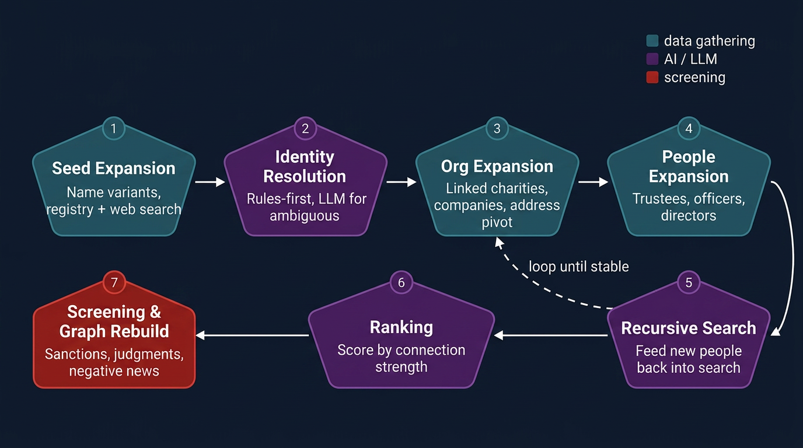

# Project Istari

Project Istari starts with one or more people and tries to answer a simple question:

"Which charities, companies, people, watchlists, and news hits are connected to them?"

It does this by searching UK public registries, deciding which hits are really about the same person, expanding outward through organisations and officers or trustees, then rebuilding everything into one combined graph that can be reviewed in a browser.

## Architecture



Open the detailed version: [`docs/architecture.svg`](docs/architecture.svg)

## What the system does

At a high level, Istari has two big phases.

1. It runs discovery for each seed name separately.
2. It rebuilds one combined graph from the latest run for each seed.

The discovery phase is about finding people and organisations.

The rebuild phase is about merging, annotating, and presenting the results.

## Discovery flow in plain English

Imagine you start with one person.

First, Istari makes a list of likely spelling variants for that person's name. It then searches the Charity Commission and Companies House for possible matches.

Next, it decides which search hits are really about the same person. Easy cases are handled by rules. Hard cases can go to an AI model. Once a hit is accepted, the linked organisation becomes part of that seed's run.

After that, Istari starts expanding outward from the organisations it has found.

It looks for:

- linked charities from Charity Commission
- a company and a charity with the same normalised name
- other organisations at the same address
- extra organisations mentioned in PDFs and filings

Then it expands the people attached to those organisations.

That means:

- trustees for charities
- officers, directors, and similar roles for companies

Then it keeps looping only through organisations.

In practice, that means newly discovered trustees or officers are kept as graph people and used for ranking, sanctions, and review, but they do not become fresh external search seeds inside the same run.

So the real discovery loop is:

1. find initial organisations from the seed
2. expand connected organisations
3. expand people from those organisations
4. run PDF enrichment across in-scope organisations
5. repeat organisation and address expansion until the run stops growing or hits its round limit

That is the core of the pipeline.

## What happens during discovery

### 1. Seed search

The system starts with a seed name and searches the UK registries for likely matches.

In the standard CLI pipeline, the main sources are:

- Charity Commission
- Companies House

Some extra discovery paths depend on API keys or feature flags being enabled.

### 2. Entity resolution

Search results are messy. The same person can appear under many spellings, and different people can share similar names.

Istari scores each candidate and decides whether it is:

- a real match
- a maybe
- not the same person

Only real matches automatically drive the network outward.

### 3. Organisation expansion

Once an organisation is in scope, Istari tries to find nearby organisations in several ways:

- a charity linked to that charity
- the same organisation appearing in the other registry
- another organisation at the same address
- an organisation mentioned in a filing or annual report PDF

This is how the graph starts to spread out from one initial seed.

### 4. People expansion

For every in-scope organisation, Istari pulls the people attached to it.

That usually means:

- trustees for charities
- officers and directors for companies

These people are stored as graph nodes and role edges.

### 5. PDF enrichment

Once an organisation is already in scope and already has people linked to it, Istari can run PDF enrichment over filings, annual reports, and similar documents for that organisation.

This can add:

- extra person evidence
- resolved organisation mentions
- unresolved organisation mentions that stay visible as low-confidence review nodes

### 6. Bounded recursion

Discovery is recursive, but only on the organisation side.

That means the pipeline can keep doing this:

"seed -> organisation -> linked organisation -> address-shared organisation"

But it does not do this anymore:

"seed -> organisation -> trustee -> fresh external people search -> another organisation"

This keeps the run bounded while still letting it pivot fully through connected organisations, registry counterparts, linked charities, address matches, and PDF-derived organisation mentions.

### 7. Ranking

At the end of a run, people are ranked by how strongly they connect into the discovered organisation network.

In simple terms, people rise higher when they connect to more important or more numerous organisations in that seed's run.

### 8. Sanctions screening

The ranked people are screened against sanctions data.

Those results are saved so they can be reused later instead of recomputed every time.

## What the pipeline does not do automatically

It helps to be clear about the limits.

- This pipeline is mainly built around UK registry discovery.
- A company is not expanded through a special "company linked companies" API in the same way charities can be expanded through linked-charity data.
- Some discovery paths only work when the needed API keys and feature flags are enabled.
- Negative news is not part of the core discovery loop. It is a separate screening layer added later.
- Egypt judgments are not part of the discovery loop either. They are attached later during graph rebuild.

## What happens after discovery

Once you have multiple runs, Istari rebuilds one combined graph from the latest run for each seed.

This rebuild stage is separate from discovery.

During rebuild, the system:

1. picks the latest run for each seed
2. merges duplicate people across runs
3. merges shared organisations and addresses
4. refreshes or reuses sanctions data
5. attaches Egypt judgments hits
6. attaches adverse-media or negative-news hits
7. builds the optional open-letters and low-confidence-node overlays
8. writes the viewer outputs

## Egypt judgments, sanctions, and negative news

These three things are related, but they are not the same.

### Sanctions

Sanctions screening happens at the end of each discovery run on ranked people.

Later, during graph rebuild, Istari reuses cached sanctions results where possible and only re-screens people whose cached record is missing or stale.

### Egypt judgments

Egypt judgments are added during graph rebuild from a curated local dataset in `data/egypt_judgments_screen.json`.

The rebuild matches graph node names and aliases against that dataset and adds the hit information onto matching person nodes.

### Negative news

Negative news is a separate adverse-media pipeline.

It does not decide who gets discovered. Instead, it works like a later annotation layer:

1. build merged person clusters from the combined graph
2. search the web for those clusters and their aliases
3. fetch and extract article text
4. classify the articles
5. store the results in a separate SQLite database
6. attach those claims back onto the rebuilt graph

So negative news is a layer on top of discovery, not the discovery engine itself.

## Open letters and low-confidence nodes

The viewer also supports two separate review overlays.

`Open letters` is the existing mapping-derived review layer. It covers signatory data, open-letter style evidence, and similar spreadsheet-imported links that should stay visually separate from the main graph.

`Low confidence nodes` are unresolved PDF-extracted organisation mentions. These are cases where the PDF extraction found an organisation name, but the pipeline could not confidently resolve it to a Charity Commission or Companies House record. They stay visible as review nodes instead of being dropped entirely.

Both overlays are built separately and exported as their own JSON payloads so they can be turned on and off independently in the viewer.

## What gets written out

After rebuild, the project writes:

- the main HTML viewer
- the main graph JSON
- the open-letters overlay JSON
- the low-confidence-nodes overlay JSON
- the address coordinate JSON used by the viewer

These outputs are written into `output/` and copied into `netlify_graph_viewer/` when that folder exists.

## Main data sources

| Source | What it is used for |
|---|---|
| Charity Commission for England and Wales | charity search, trustees, linked charities |
| Companies House | officer search, company records, appointments |
| Serper | web search for some registry discovery and adverse media |
| Gemini / OpenAI | entity resolution, PDF extraction, translation, article classification |
| Local sanctions data | sanctions screening |
| `data/egypt_judgments_screen.json` | curated Egypt judgments annotation during rebuild |
| `data/negative_news.sqlite` | stored adverse-media results |

## Quick start

```bash
# Install
pip install -e .

# Copy environment template
cp .env.example .env

# Create the SQLite schema
python -m src.cli init-db

# Run one seed
python -m src.cli run-name "Jane Smith"

# Run several seeds
python -m src.cli run-seeds "Jane Smith" "John Doe"

# Rebuild the combined graph from the latest run for each seed
python scripts/rebuild_graph.py

# Launch the local viewer
python -m src.cli web-ui
```

## Useful commands

| Command | What it does |
|---|---|
| `init-db` | create the main SQLite schema |
| `run-name NAME` | run the full discovery pipeline for one seed |
| `run-seeds NAME [NAME ...]` | run the full pipeline for multiple seeds |
| `step1-seed NAME` | run only the first search and resolution step |
| `step2-orgs RUN_ID` | expand connected organisations only |
| `pdf-enrich RUN_ID` | run PDF enrichment for one run |
| `step3-people RUN_ID` | expand trustees and officers only |
| `step4-ofac RUN_ID` | run sanctions screening only |
| `negative-news NAME [NAME ...]` | run adverse-media search for one or more names |
| `negative-news-clusters` | run adverse-media screening over merged graph clusters |
| `negative-news-extract-test URL` | fetch one page and inspect extraction output |
| `export-network --run-id ID` | export graph JSON for selected runs |
| `web-ui` | launch the local viewer |
| `healthcheck` | check keys and local tooling |

## Negative-news workflow

There are two ways negative news is used here.

The first is a one-off person search:

```bash
python -m src.cli negative-news --pages 2 --num 10 "Jane Smith"
```

The second is the merged-cluster workflow, which works from the rebuilt graph:

```bash
python -m src.cli negative-news-clusters --offset 0 --limit 50
python scripts/run_negative_news_chunks.py
```

That cluster workflow:

- builds merged person clusters from the latest runs
- searches on cluster names and aliases
- uses linked organisation names as extra context terms
- stores results in `data/negative_news.sqlite`
- reattaches those results to the graph during rebuild

## Important implementation notes

- The latest run for each seed is what feeds the combined graph rebuild.
- Sanctions are cached and reused where possible.
- Egypt judgments and negative news are both attached after graph consolidation.
- The negative-news store is separate from the main discovery database.
- Recursive widening now happens through organisations, registry counterparts, linked charities, addresses, and PDF-derived organisation mentions, not through downstream external searches on newly discovered people.
- The architecture image above is meant to reflect the code path in `src/services/mvp_pipeline.py`, `scripts/rebuild_graph.py`, `src/graph/egypt_judgments.py`, and `src/graph/adverse_media.py`.
